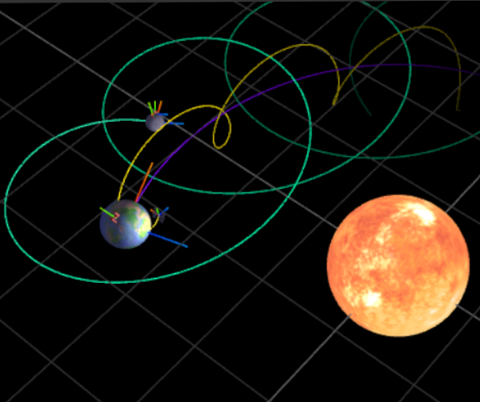
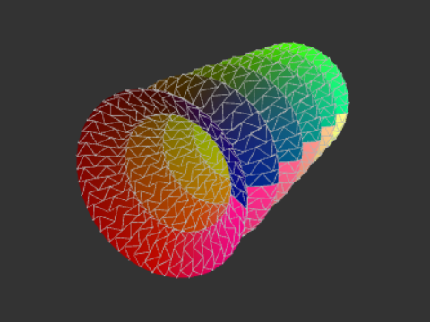

# Sistemas gráficos

* Alumno: Matías Lafroce

* Cuatrimestre: 2do cuatrimestre 2022

## Contenido

`/labs`: ejercicios prácticos del campus (ver en pages [tp1](https://mlafroce.github.io/sistemas-graficos/labs/tp1) y [tp2](https://mlafroce.github.io/sistemas-graficos/labs/tp2))

`/tp1`: trabajo práctico individual obligatorio (ver en [pages](https://mlafroce.github.io/sistemas-graficos/tp1))

